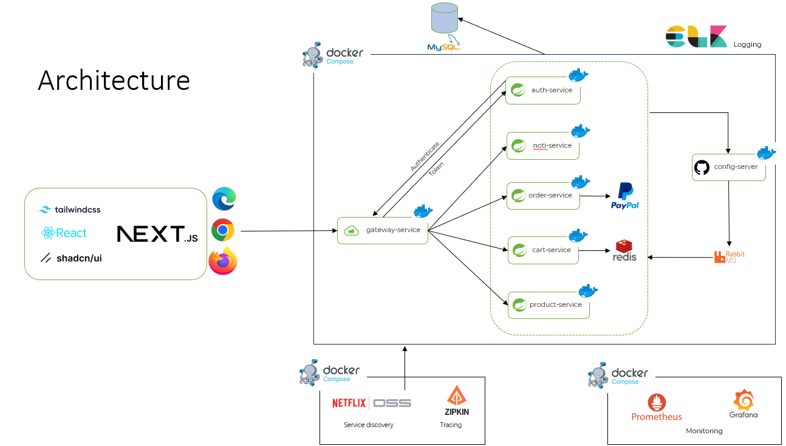
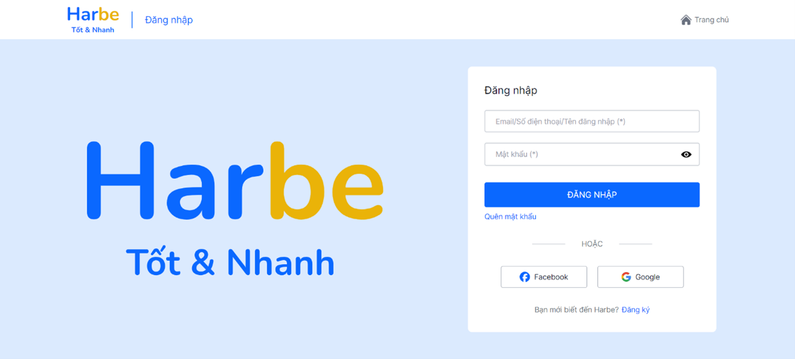
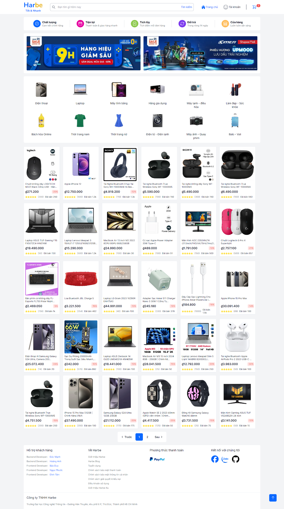
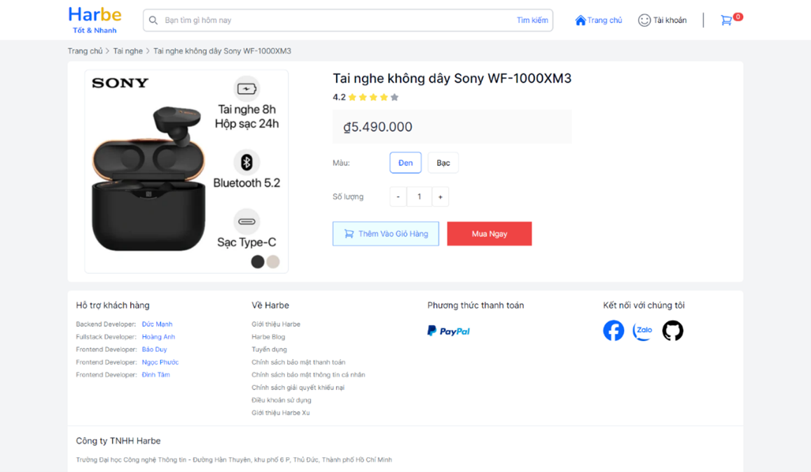
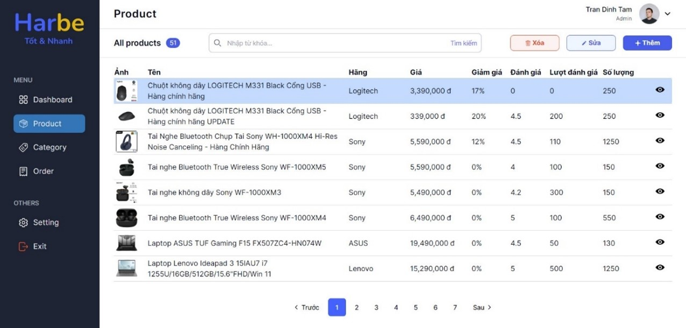
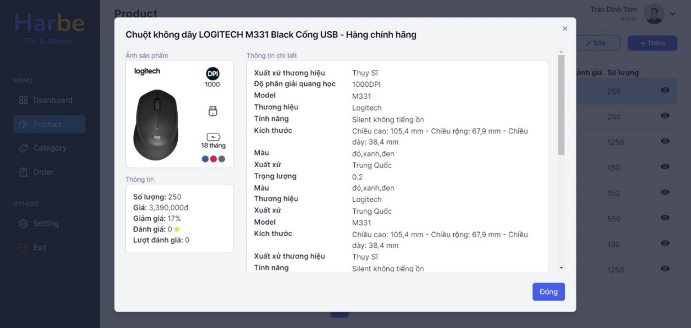
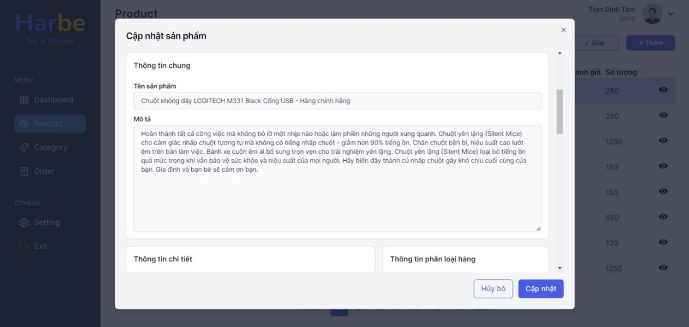
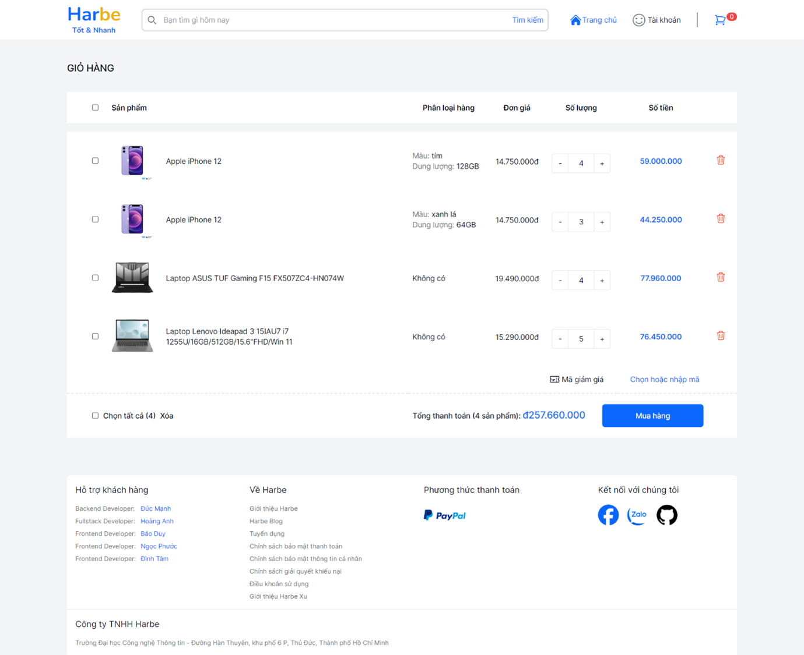

Link to Backend repo: [Harbe](https://github.com/AndrewNguyen-05/Harbe)

# Harbe-FE

### Contributors

- Nguyen Van Hoang Anh - 21520144@gm.uit.edu.vn - [Github](https://github.com/AndrewNguyen-05) - [Facebook](https://www.facebook.com/andrew.nguyen0505/)
- Tran Dinh Tam - 21522574@gm.uit.edu.vn - [Github](https://github.com/Griselda4774) - [Facebook](https://www.facebook.com/profile.php?id=100036010281125)
- Truong Hoang Bao Duy - 21520789@gm.uit.edu.vn - [Github](https://github.com/truonghoangbaoduy) - [Facebook](https://www.facebook.com/baoduy.truonghoang.581)
- Phan Ngoc Phuoc - 21520405@gm.uit.edu.vn - [Github](https://github.com/PhuocPhann162) - [Facebook](https://www.facebook.com/phuocphan162)

### Description

- Harbe is an ecommerce system utilizing microservices architecture, using NextJS, ReactJS, TailwindCSS for frontend.
- I use SpringBoot to for services, Spring Cloud to make gateway, config server for microservices, Resilience4j to handle error, RabbitMQ to sync between services and Zipkin for tracing.
- The database I choose for this project is MySQL and Redis for cart service.
- You can see the report [here](https://drive.google.com/file/d/1FtmhXKs8Z4rKs--6F-V3U9HTLlpZFCcx/view?usp=sharing)

  
  
<i>Application Architecture</i>

### Technologies and Framework
- Back-end
  - Java 17
  - Spring Boot 3: Authorization Server (OAuth 2), Statemachine ...
  - Spring Cloud Gateway, Open Feign, Stream ...
  - Elastic stack: Elasticsearch, Logstash, Kibana, Filebeat
  - Grafana stack: Prometheus, Grafana
  - Zipkin
  - Redis
- Front-end
  - NextJS 14
  - ReactJS
  - TailwindCSS
  - RadixUI
  - ShadcnUI

### Demo
Some of the pictures of this Application

  
  
<i>Login Screen</i>

  
  
<i>Homepage Screen</i>

  
  
<i>Detail product Screen</i>

  
  
<i>Admin product Screen</i>

  
  
<i>Admin detail product Screen</i>

  
  
<i>Admin update product Screen</i>

  
  
<i>Cart Screen</i>

